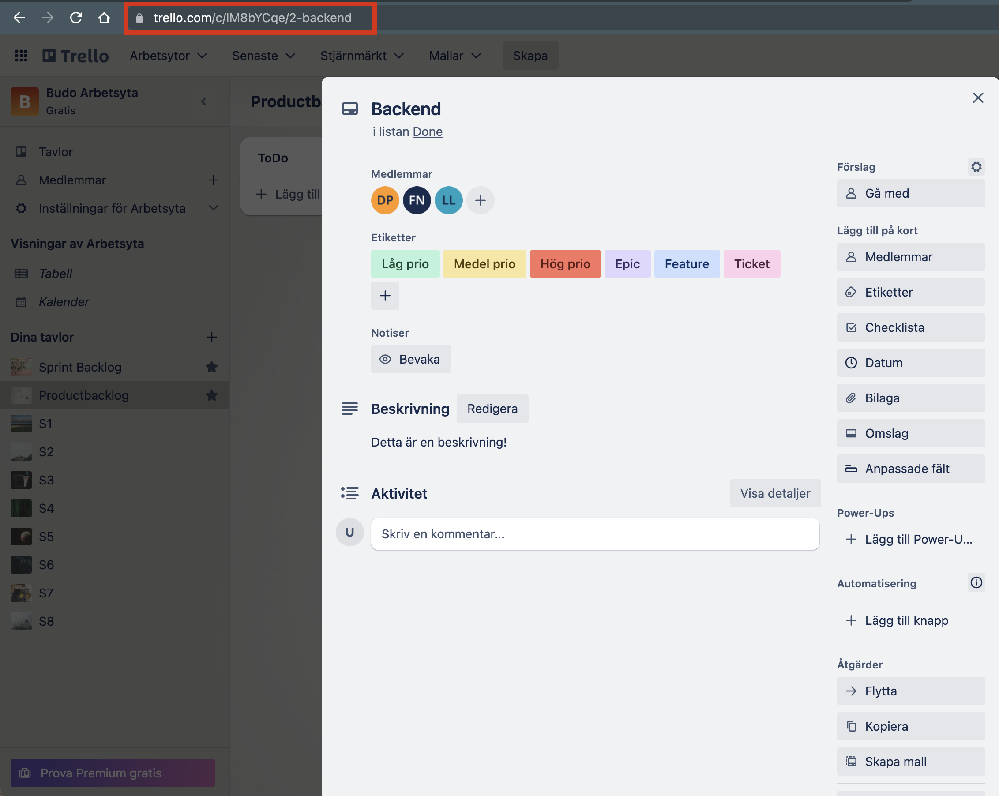

# Dokumentation

* **Användarhandledning:** [user-guide](/user-guide)
* **API:** [Swaggerhub](https://app.swaggerhub.com/apis-docs/Calzone/PvtOpenApi/1.0.0)
* **JavaDoc:** TODO

## Projektkalender
Can be found -> [HERE](https://docs.google.com/spreadsheets/d/109tNRiRW9tyxdab9B4ap0jj3ZXgl275GzOLMBALoqUw/edit?usp=sharing)

## Beslut
Beslut som tas loggas genom en beslutslogg för respektive grupp/chapter.

[Mall](/Mallar/beslut.md)

### Vilka beslut loggas?
- Alla beslut som tas inom chapters som påverkar projektet ska dokumenteras under respektive chapter - [Chapters](/Chapters)
- Små beslut inom grupperna som påverkar gruppen dokumenteras under respektive grupp. Här ska ej projektövergripande beslut loggas - [Grupper](/Grupper).
- Projektövergripande beslut som tas utanför chapters loggas i filen övriga beslut - [Övriga beslut](/övriga_beslut.md)

# Tickets

Vi använder Trello som ticketsystem. Varje Squad har en egen *workspace* tänkt för sin sprint backlog.

* [Squad 1](https://trello.com/invite/b/gIj8YCgc/ATTI3570c5be45c850c68155dda28a28247d0ECD7B73/s1)
* [Squad 2](https://trello.com/invite/b/Jz3lmqWW/ATTIcaddc49ffa8b79612214f66a3fe739ccFEDD2778/s2)
* [Squad 3](https://trello.com/invite/b/uFUITEAw/ATTI71055af22c2db8b327817871a2f1c28594CFDC2B/s3)
* [Squad 4](https://trello.com/invite/b/2lLkF0WT/ATTIadaf37218599026335cbaad6f62cfac0BBB8A87B/s4)
* [Squad 5](https://trello.com/invite/b/Eu3EMH67/ATTI3c74d0c72a9473f36bfb4b2fccb64bdaB6C95EBE/s5)
* [Squad 6](https://trello.com/invite/b/NrosMr70/ATTIffb979fe8d745a3d894098d7d3039122BB2D35CA/s6)
* [Squad 7](https://trello.com/invite/b/EFys1SlW/ATTIcb558a4852cfbdf0fcd99cf5ac2a665535BF21FA/s7)
* [Squad 8](https://trello.com/invite/b/Phbgoxtd/ATTI44e9d2c1d31680f1fc304edf652ab43438FE10C4/s8)

Ifall du upptäcker en bugg eller annat förbättringsområde som normalt sett hade varit ett issue i gitlab lägger du till denna i listan "Issues/PO" på din workspace. Denna ska ha en kort titel **och** beskrivelse. Ifall du har hittat en bugg ska du ge en beskrivning om vilka steg du tog och hur den går att reproducera. 

Generellt arbetsflöde:

1. Ta en ticket från `TODO` listan och lägg till dig själv som medlem genom att öppna ticketen och klicka "gå med". Flytta sedan ticketen till "In progress".
2.  Nödvändig info som upptäcks under jobbet ska läggas som kommentar (se bild nedan)
3. **OBS:** När man är klar med en ticket ska man länka till den i sin commit, se bild för vad man ska länka (detta för att vi snabbt ska kuna hitta en ticket i arkivet om så behövs).
4. När en hel sprint är färdig skall samtliga tickets under "Done" läggas som arkiverade. Detta görs genom att klicka på ticketen och sedan klicka på "arkivera". Detta flyttar ticken från eran arbetsyta till arkivet.

*Vilken länk man ska använda i sin git commit*

