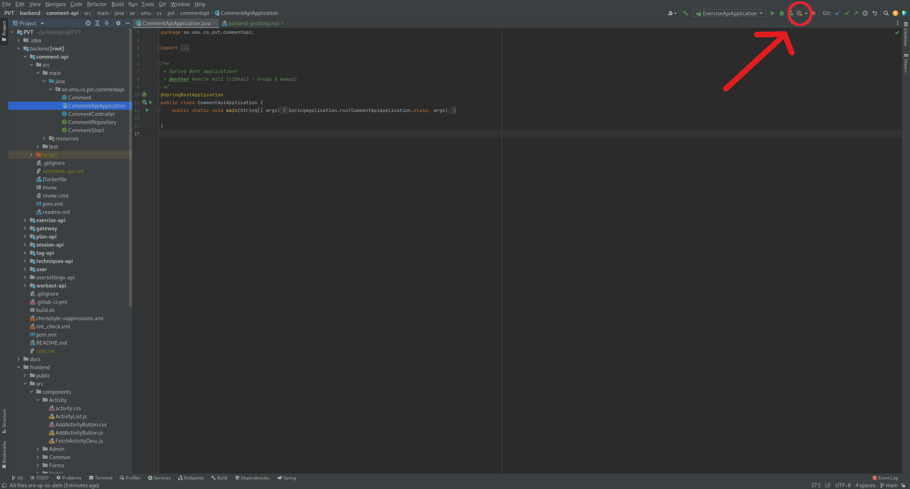
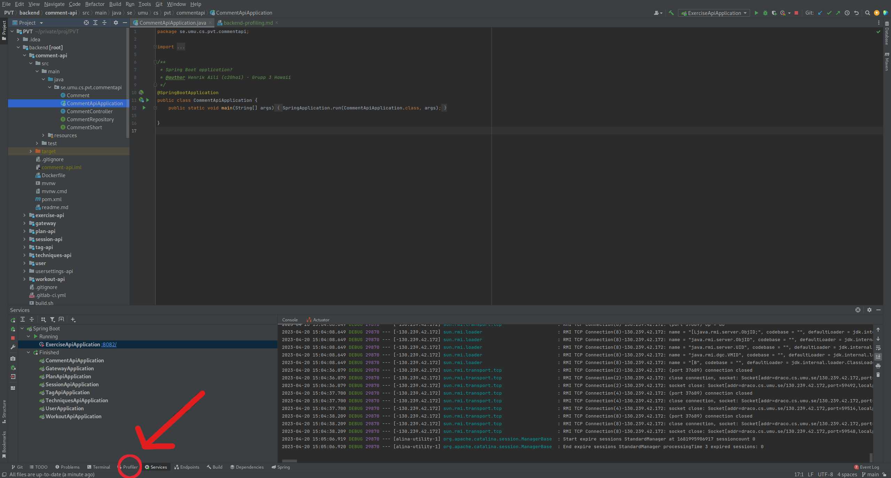

# Profiling

## Backend

1. Starta upp IntelliJ (se till att du har Ultimate edition, det är gratis för studenter).

2. Kör den Applikationen som ska mätas med IntelliJs inbyggda profiler

3. Öppna Profiler-fönstret och tryck på "Stop Profiling and Show Results". 

4. Du kan nu se hur mycket resurser som denna ApiApplication drog. För att se hur mycket minne som drogs, öppna Call Tree och byt från "CPU Samples" till "Memory Allocations". Detta låter en se hur mycket minne programmet använde samt vilka delar som drog mest.

