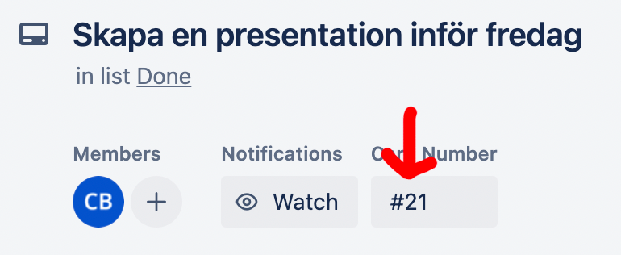
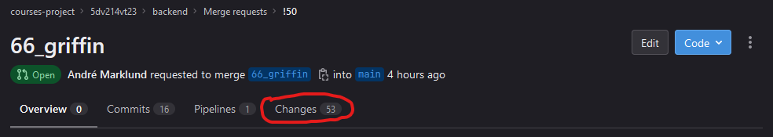
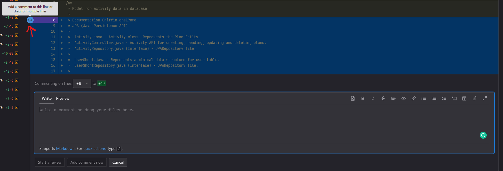
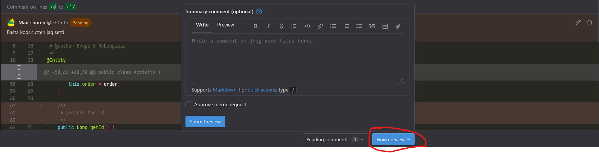

<h1>Yotei Git Workflow</h1>

Yotei's git is divided into four repositories.
- Backend - This repository holds the codebase and all documentation for the backend.
- Frontend - This repository holds the codebase and all documentation for the frontend.
- Infrastructure - This repository holds the config files, including the docker compose file.
- Documentation - This repository holds all user documentation.

<h2>Working on a ticket</h2>
<h3>Creating a branch</h3>
When working on a ticket the developer should branch to a devloper branch with 

`git switch -c <branch_name>`

The branch name needs to be `[card_number]_[squad-name]`, e.g `21_kraken`. This should be followed, as it will simplify managing branches.

To see all available branches use the command:

`git branch`

Push the branch to origin with the command: 

`git push -u origin [branch_name]` 

Example:
`git push -u origin 21_kraken`

When working on a feature branch remember to commit **often** and make sure to push to the feature branch at the **end of the day**.

<h3>Working on a pre-existing branch</h3>
First create a local branch with a reasonable name
`git switch -c <branch_name>`

After this you want to associate it with the pre-existing branch created on the remote repository
`git branch --set-upstream-to=origin/<branch_name_to_fetch>`

Now you are ready to pull.

<h2>Done with ticket</h2>
When the feature has been implemented and is ready to be integrated into the main branch, the developer should rebase onto the remote main branch with the command. This command will pull the latest changes from main and rebase.

`git pull --rebase origin main` (Pull is short for both fetch and merge)

If any conflicts arise the developer will have to resolve the conflicts **manually** using either an IDE or the terminal.
You will see the conflicts with the text `CONFLICT <file>` after running the above command.
The developer can then use 

`git diff`

This will locate the markers (<<<<<<), and the developer can then fix these conflicts. The next step will be

`git add <filename>`

To add each file with a resolved conflict, then use the command

`git rebase --continue`  

To continue with the rebase. Alternatively the developer could abort the rebase with the command

`git rebase --abort`

After the rebase, you should run:

`git push origin <your branch>`

It may be neccessary to append `-ff` to fast forward if your branch is behind. 
(I.e. if you get a message saying something about being behind, run `git push origin <your branch> -ff`)

If the rebase was successful, a merge request should be sent using the gitlab website. The following template should be used when creating a new merge resuest via the website.
- Title - `<branch_name: Short description of what was implemented>`
- Description -

        [Trello ticket link]

        [A more detailed description about what has been implemented and how it has been done.]

### Tags
The backend and frontend repos both use an automated pipeline with build, test and potentially deployment stages. If for some reason you want to skip these steps you can add `[skip]` **at the start** of your commit message. This can be useful if you have unfinished changes and still want to push to the remote or if your work contains purely documentation changes.
**Note:** To merge a branch with `main`, the final commit on the branch **must not** skip the pipeline or the merge request will be denied automatically.
**Example:** 
`git commit -m "[skip] Documentation changes"`

### Example of merge request:

<h3>Assigning a reviewer</h3>
The merge request can only be approved by a DevOps, they will however not be obliged to review the code. Instead always assign one reviewer (not a DevOps) of your choice to review the merge, if no reviwer has been appointed or have not reviewed the code, DevOps will not approve the merge request regardless of content. If a reviewer has been assigned and has approved the merge a DevOps will approve the merge request and the updated main branch will be automatically deployed on the test server.

<h2> Reviewing a merge request </h2>
If you have been assigned to review a merge request, start by clicking the changes tab.

Review the code start your review by pressing the comment icon by the line number.

When done reviewing the code, click the Finish review button located at the bottom of the screen. You may write an optional summary and then submit the review.

After submitting the review, you will be brought back to the merge request. It is **important** to press the **Approve** button so that DevOps can see that the merge request has been reviewed!

## Gitikett
- Help each other.
- Make sure to commit often.
- Always `pull` from **main** before creating a new branch.
- Always `rebase` to **origin/main** before creating a merge request to **main** branch.
- At the end of the day, `push` changes to your feature branch, in case you are sick/not available the day after, such that another member of the squad can continue working on the feature.
- If you work on a larger feature, make sure to `rebase` to origin/main continuously (perhaps a couple of times per day), to handle conflicts as you go intead of having to handle all conflicts before a merge request. 

                
    
