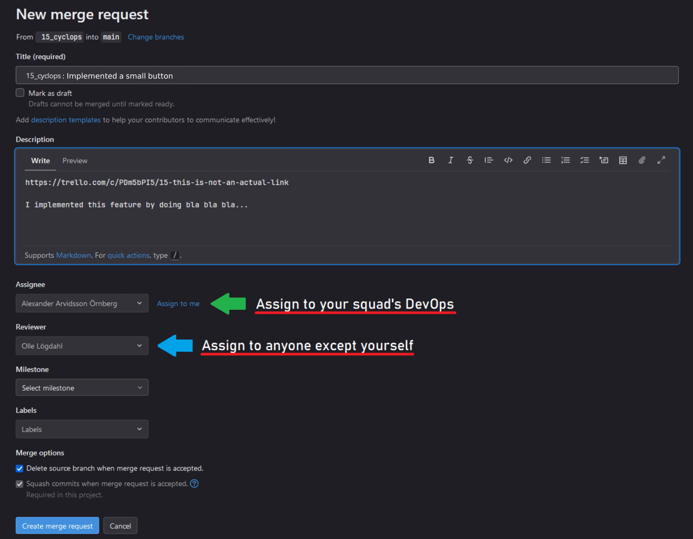

<h2>Yatoi Git User Manual</h2>

Yatoit's git is divide into four repositories.
- Backend - This repository holds the codebase and all documentation for the backend.
- Frontend - This repository holds the codebase and all documentation for the frontend.
- Infrastructure - This repository holds the config files, including the docker compose file.
- Documentation - This repository holds all user documentation.

<h3>Working on a ticket</h3>
When working on a ticket the developer should branch to a devloper branch with 

- git switch -c <branch_name>

The branch name needs to be #[ticket_name]_[squad_name], e.g #mockticket_kraken-killers. This should be followed, as it will simplify managing branches.

When working on a feature branch remember to commit **often** and make sure to push to the feature branch at the **end of the day**.

When the feature has been implemented and is ready to be integrated into the main branch, the devloper should rebase the developer branch with the main branch using the command

``git rebase main``

If any conflicts arise the rebase will stop and leave conflict markers on the conflicting areas. The developer can then use 

``git diff`` 

This will locate the markers (<<<<<<), and the developer can then fix these conflicts. The next step will be

``git add < filename >`` 

To add each file with a resolved conflict, then use the command

``git rebase --continue``    

To continue with the rebase. Alternatively the developer could abort the rebase with the command

``git rebase --abort``

If the rebase was successful, a merge request should be sent using the gitlab website. The following template should be used when creating a new merge resuest via the website.
- Title - <branch_name>
- Description - 
        
        <ticket link>
        <Description, a breif description about what has been implemented and how it has been done.> 
Always remeber to check both "Delete source branch" and "Squash commits".
The merge resuest can only be approved by a DevOps however DevOps will not be obliged to review the code. Instead always assign one reviewer(not a DevOps) of your choice to review the merge, if no reviwer has been appointed DevOps will not approve the merge request regardless of content. 

### Example of merge request:

If a reviewer has been assigned and has approved the merge a DevOps will approve the merge request and the updated main branch will be automatically deployed on the test server.

After the merge a Squash commit will be produced with the following format.

    %{title}

    Merge branch '%{source_branch}' into '%{target_branch}'

    Reviewed by %{reviewed_by}
    Approved by %{approved_by}

    Description
    %{description}

    Branch commits
    %{all_commits}

                
    
