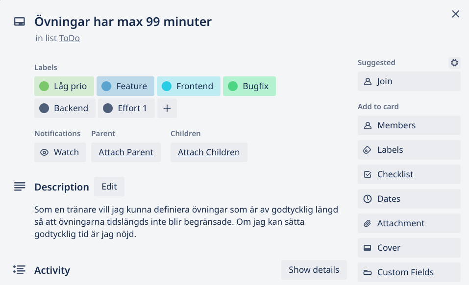

**En beskrivande titel**

---

Som en xxx vill jag xxx för att xxx

En beskrivande beskrivning

Acceptansnivå på när en ticket avses klar

---

OBS: Glöm ej att använda rätt taggar på din ticket\
"Effort" taggen avser hur många arbetsdagar det tar att utveckla. Dessa är exponentiella; 1, 2, 4. Ifall du tror en ticket tar 8 dagar ska du bryta ner den i minst 2*4.

Exempel:

